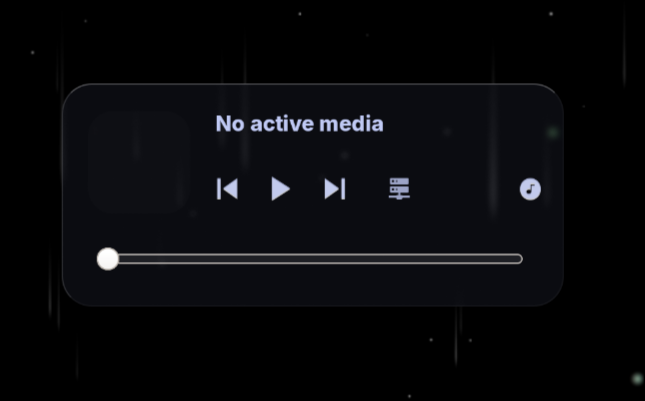
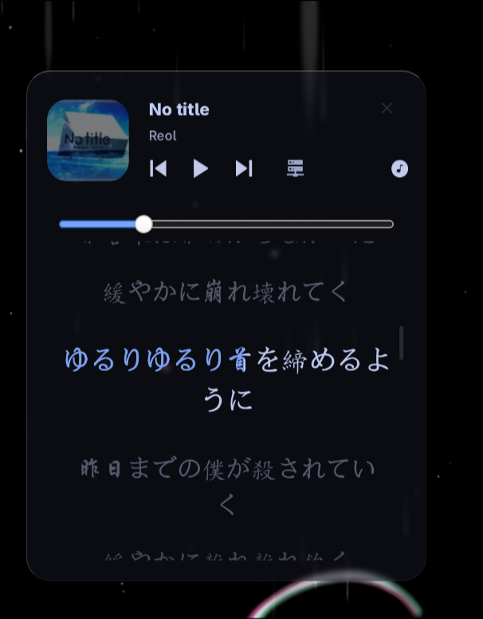
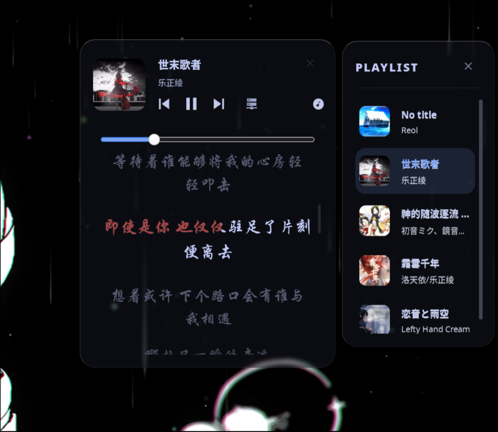

# AGS Media Player (Astal V3 架构)

基于 AGS (Aylur's Gtk Shell) 构建的模块化、高性能桌面媒体播放器组件。
## 📷 界面预览
<p align="center">
  
</p>
<p align="center">
  
</p>
<p align="center">
  
</p>

---
##  核心

- **逐字高亮画布渲染**：打破传统 DOM 频繁重绘的性能瓶颈，直接使用 Cairo 引擎结合 Pango 布局进行像素级底层歌词绘制。支持 `.krc` 与 `.lrc` 歌词解析、多行防重叠自适应排版。
* **lrc字幕示例(来自krc破解)**: [269598,1493]<0,368,0>曲<368,369,0>终<737,271,0>之<1008,448,0>时 
- **双轨状态裁决机制**：解决 Linux 桌面环境下多播放器并存时的焦点死锁痛点。通过专属通道直接获取 MPD 状态，同时利用 `playerctl` CLI 引擎进行低开销轮询，精准识别各类浏览器（如 Chrome、Firefox）以及 Electron 应用的播放状态。
- **视觉与逻辑解耦**：所有颜色、尺寸、位置锚点及专属单曲高亮色彩，均通过统一的 `Config.ts` 暴露，实现一行代码更改全局主题。

## 性能与资源消耗

- **歌词滚动与逐字高亮重绘时**：由于移除了高频正则匹配并缓存了 Pango 布局高度，单核 CPU 占用率稳定在 4% ~ 7.3%。
- **暂停或无媒体静默时**：自动挂起定时重绘队列，单核 CPU 占用率降至 0.3% 以下。
- **内存占用**：内置 LRU 缓存机制，仅保留最近 10 首歌曲的歌词解析数据，从根源避免长时运行导致的内存泄漏。

## 运行逻辑与行为响应

组件通过内置状态机进行焦点和 UI 的精确控制，核心触发逻辑如下：

- **MPD 绝对优先**：MPD 拥有最高优先级。当 MPD 播放时，UI 锁定显示本地音乐信息，自动屏蔽后台浏览器的音频流干扰。
- **无缝焦点退让**：MPD 暂停后释放优先级，但保持 UI 面板展开。此时若浏览器开始播放媒体，UI 将无缝接管并切换至浏览器音源。
- **零延迟点歌**：点击播放列表时，通过 `playerActionBus` 事件总线直接向核心推送预计算的绝对路径及媒体元数据，消除底层异步查询的时间差，实现封面与歌词 0 毫秒秒出。
- **一键销毁与折叠**：点击面板 X 按钮，将下发 `mpc pause` 指令并同步销毁当前内存状态。UI 会回归 "No active media" 状态，歌词及播放列表面板将自动折叠隐藏。
- **智能歌词嗅探**：当检测到当前媒体无本地歌词文件时，自动隐藏下方 Cairo 绘图区域，面板平滑收缩。

---

## 部署与使用教程 (Astal V3 标准版)

**重要提醒**：最新的 Astal V3 引擎放弃了旧版的内置黑盒查找路径，全面拥抱标准的 NPM 模块解析。因此，**正确配置 `package.json` 是让组件跑起来的唯一前提**。

### 第一步：安装系统底层依赖

请务必在终端执行以下命令，确保你的 Linux 系统已安装所需的核心控制组件与底层库：

```bash
# Arch Linux 用户 (使用 pacman 与 yay)
sudo pacman -S playerctl mpd mpc
yay -S ags-git libastal-git
```

*(注：请确保系统中包含 `/usr/share/astal/gjs` 目录，这是 AGS 官方 JS 包装库的物理存放点。)*

### 第二步：建立 V3 标准工程环境 (核心)

创建一个标准的配置目录，并通过 `package.json` 建立到系统底层库的映射，防止 AGS 的打包器（esbuild）去公网寻找不存在的包。

```bash
# 1. 创建配置目录
mkdir -p ~/.config/ags
cd ~/.config/ags

# 2. 写入标准的 package.json (将 astal 指向本地系统路径)
echo '{
  "name": "ags-player-config",
  "version": "1.0.0",
  "type": "module",
  "dependencies": {
    "astal": "/usr/share/astal/gjs"
  }
}' > package.json

# 3. 建立本地软链接依赖 (必须执行)
npm install
```

### 第三步：部署核心代码

将本项目的核心文件（`player.ts`、`playlist.ts`、`Config.ts`）全部放入 `~/.config/ags/` 目录下。

你需要一个标准的**应用挂载入口**，请创建并确保你的 `app.ts` 如下所示：

```typescript
import { App, Astal } from "astal/gtk3"
import { Box, Window } from "astal/gtk3/widget"

// 引入本地播放器与播放列表模块
import Playlist, * as playlistMod from "./playlist"
import { buildPlayerCard, playerStyle } from "./player"

// 核心修复 1：在启动前完美组装并注入全局 CSS，防止组件样式坍塌
const playlistStyle = (playlistMod as any).playlistStyle || ""
const globalStyle = `
window { background-color: transparent; }
` + playerStyle + playlistStyle

App.start({
    instanceName: "ags-media-player",
    css: globalStyle, // 将组装好的样式直接托管给应用引擎
    main() {
        
        //  1. 播放列表窗口挂载 ---
        // Playlist() 内部会返回一个已经实例化的 Window 对象
        try {
            const playlistWin = Playlist()
            if (playlistWin) {
                if (typeof (App as any).add_window === "function") {
                    (App as any).add_window(playlistWin)
                } else if (typeof (App as any).addWindow === "function") {
                    (App as any).addWindow(playlistWin)
                }
                console.log("app: 播放列表窗口安全挂载成功")
            }
        } catch (e) {
            console.error("app: 播放列表窗口挂载失败:", e)
        }


        // --- 2. 播放器主窗口挂载 ---
        try {
            const playerCard = buildPlayerCard()
            
            const playerWindow = new Window({
                name: "desktop-player",
                namespace: "desktop-player", // 供 Hyprland 动画或模糊规则捕获的类名
                anchor: Astal.WindowAnchor.TOP | Astal.WindowAnchor.RIGHT, // 靠屏幕右上角锚定
                layer: Astal.Layer.BOTTOM, // 钉在桌面最底层，不遮挡输入焦点
                marginTop: 150, 
                marginRight: 260,
                child: new Box({
                    vertical: true,
                    className: "player-interior", // 绑定 player.ts 里的面板样式
                    children: [playerCard]
                })
            })
            
            if (typeof (App as any).add_window === "function") {
                (App as any).add_window(playerWindow)
            } else if (typeof (App as any).addWindow === "function") {
                (App as any).addWindow(playerWindow)
            }
            console.log("app: 播放器主窗口安全挂载成功")
            
        } catch (e) {
            console.error("app: 播放器主卡片挂载失败:", e)
        }
    }
})
```

### 第四步：启动服务

确保本地的 MPD 服务已在后台正常运行，然后在终端启动 AGS：

```bash
# 启动播放器
ags run --gtk 3 & disown
```

如果你修改了代码需要热重载，可以使用以下命令：

```bash
killall -9 ags astal gjs
ags run --gtk 3
```

---

## 前端配置接口 (Config.ts)

所有的视觉风格均可在 `Config.ts` 中一键修改，无需深入业务代码：

- **尺寸约束 (`sizes`)**：设定播放器的标准宽度、歌词显示区域高度等。
- **播放器位置 (`position`)** 设定播放器在桌面上的位置
- **排版字体 (`fonts`)**：支持分别设定常规英文字体与中文字体（会自动检测歌词文本中的汉字并切换渲染字体）。
- **动态主题色彩 (`theme`)**：支持修改 `playerBg` / `playlistBg`（面板底层磨砂玻璃色彩）、`accentColor`（进度条与活跃元素的强调色）。
- **单曲色彩 (`customSongColors`)**：支持通过歌曲名关键字映射专属的 RGB 色彩。当播放特定歌曲时，歌词高亮与渲染底色将自动产生联动变换。

## 避坑指南与注意事项

- **ESBuild "Could not resolve" 错误**：如果你在启动时遇到此报错，说明你的 `package.json` 丢失或未执行 `npm install`。Astal V3 必须依赖本地 `node_modules` 的路径映射才能通过编译。
- **音乐库路径解析**：默认以 `~/Music` 为本地歌词与音频文件的探测根目录。如果你修改了 MPD 的工作目录，请同步修改 `player.ts` 中的 `resolveLocalAudioPath` 函数。


